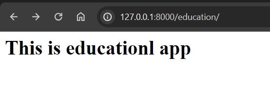
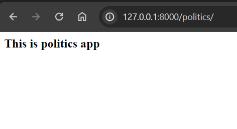

# Crate a django project, inside this project create 3 application named as EducationApp, CricektApp, PoliticsApp to get all the information about this fields.

## Steps to create the project
1. Create a folder named as P003 
  ``` mkdir P003 ```
2. Create django project inside that folder 
    ``` django-admin startproject NewsProject ```
3. Enter to the project folder now
 ``` cd NewsProject```
4. Create the first application named as EducationApp, CricektApp, PoliticsApp .
- First app: ``` python manage.py startapp EducationApp ```
- Second app: ``` python manage.py startapp CricektApp ```
- Third app: ``` python manage.py startapp  PoliticsApp ```

5. Install all 3 apps inside setting.py file of main project.(Django dont know about our application, so we have to installed it inside settings.py file.

)
> NewsProject/NewsProject/settings.py
```
INSTALLED_APPS = [
    'django.contrib.admin',
    'django.contrib.auth',
    'django.contrib.contenttypes',
    'django.contrib.sessions',
    'django.contrib.messages',
    'django.contrib.staticfiles',
    'EducationApp',
    'CricketApp',
    'PoliticsApp',
]
```
6. Define view function for EducationApp
> NewsProject/EducationApp/views.py

```
from django.shortcuts import render,HttpResponse

def education_view(request):
    return HttpResponse('<h1>This is educationl app</h1>')

```
7.Configure url pattern for EducationApp
> NewsProject/NewsProject/urls.py

```
from django.contrib import admin
from django.urls import path
from EducationApp import views 


urlpatterns = [
    path('admin/', admin.site.urls),
    path('education/',views.education_view),
   
]

```
8. Define view function for CricektApp
> NewsProject/CricektApp/views.py

```
from django.shortcuts import render,HttpResponse

def cricket_view(request):
    return HttpResponse('<h2>This is cricket app</h2>')

```
9. Configure url pattern for CricketApp
> NewsProject/NewsProject/urls.py

```
from django.contrib import admin
from django.urls import path
from EducationApp import views as v1
from CricketApp import views as v2


urlpatterns = [
    path('admin/', admin.site.urls),
    path('education/',views.education_view),
     path('cricket/',v2.cricket_view)
]
```

10.  Define view function for PoliticsApp
> NewsProject/PoliticsApp/views.py
```
from django.shortcuts import render,HttpResponse

def politics_view(request):
    return HttpResponse('<h3>This is politics app</h3>')

```

11. : Configure url pattern for PoliticsApp
> NewsProject/NewsProject/urls.py

```
from django.contrib import admin
from django.urls import path
from EducationApp import views as v1
from CricketApp import views as v2
from PoliticsApp import views as v3

urlpatterns = [
    path('admin/', admin.site.urls),
    path('education/',v1.education_view),
    path('cricket/',v2.cricket_view),
    path('politics/',v3.politics_view)
]

```
12. Runserver and send Http Request
```
py manage.py runserver
```

## request 1 :  http://127.0.0.1:8000/education/


## request 2 :  http://127.0.0.1:8000/cricket/


## request 3 :  http://127.0.0.1:8000/politics/


